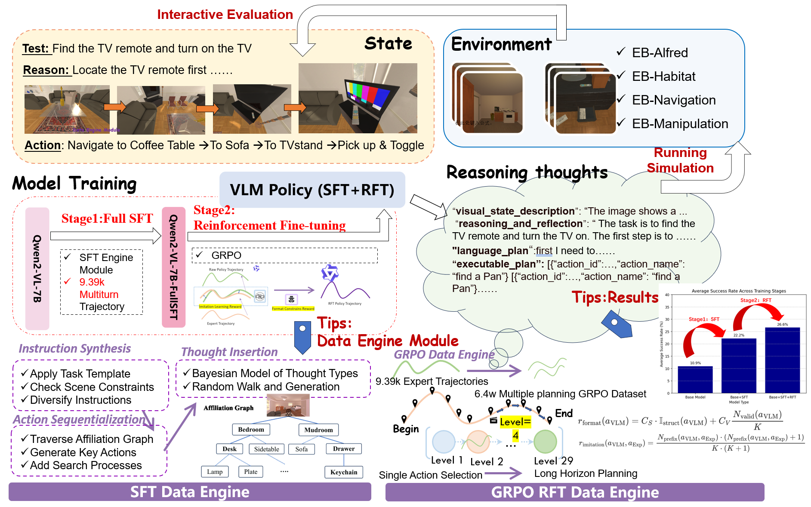
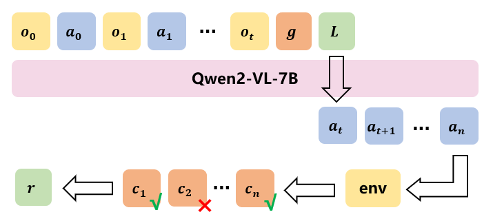
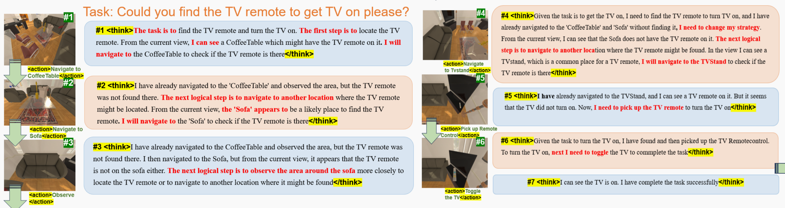

# EgoReasoner  

> **DRL Course Projects**: Ego-embodied Reasoner: Egocentric Embodied Reasoning and Planning with MLLM via Reinforcement Learning  

**Note**: The code repository in GitHub contains raw experimental code and serves as an **experimental record only**. It has not been cleaned or optimized for production use. Please note that the code structure may include unorganized scripts, temporary logs, and experimental configurations.  

EgoReasoner is a framework designed to enhance the embodied reasoning and long-horizon planning capabilities of Multimodal Large Language Models (MLLMs) using a hybrid training pipeline. By combining **Supervised Fine-Tuning (SFT)** on synthetic expert trajectories and **Group Relative Policy Optimization (GRPO)**, the framework enables smaller-scale MLLMs to achieve competitive performance in complex embodied tasks such as interactive search and manipulation.  

### Pipeline 
  

1. **Data Synthesis**: Generate expert trajectories using a hybrid system of rule-based logic and LLM calls, covering tasks like search, manipulation, and transportation.  
2. **SFT Stage**: Fine-tune a base visual-language model (e.g., Qwen2-VL-7B) on synthetic trajectories to instill structured reasoning and action formatting.  
3. **GRPO Stage**: Refine the policy using relative preferences between trajectory groups, with both offline (imitation-based) and online (simulation-based) variants.  
4. **Evaluation**: Test on EmbodiedBench benchmarks (EB-ALFRED, EB-Habitat) for interactive embodied tasks.  

### Formulation  
  

The problem is formulated as a sequential decision-making task where an agent:  
- Receives visual-language observations $o_t$ and follows a policy $\pi_\theta$ to take actions $a_t$.  
- Aims to complete a language-grounded goal $g$ through a trajectory $\tau = \{g, o_0, a_0, ..., o_n, a_n\}$.  

The policy is optimized to maximize task success by integrating SFT and GRPO, as defined by the GRPO objective function.

### Stage-wise Performance  
| Model Stage        | Success Rate (%) |
| ------------------ | ---------------- |
| Zero-shot (Base)   | 10.9             |
| After SFT          | 22.2             |
| After GRPO (Final) | 26.6             |

### Demo

  

**Task Example**: Find the TV remote and turn on the TV.  
1. **Reasoning**: Locate the TV remote → Navigate to furniture (coffee table, sofa, TV stand).  
2. **Actions**: `Navigate to Coffee Table` → `Pick up Remote` → `Toggle TV`.  
3. **Result**: Successful task completion via structured reasoning and action execution.  
